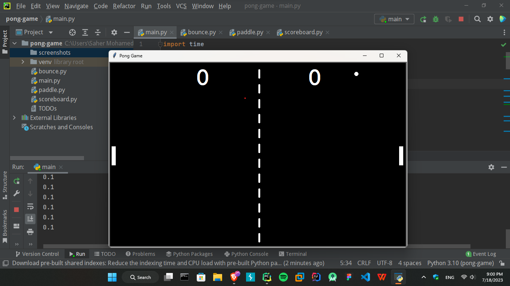
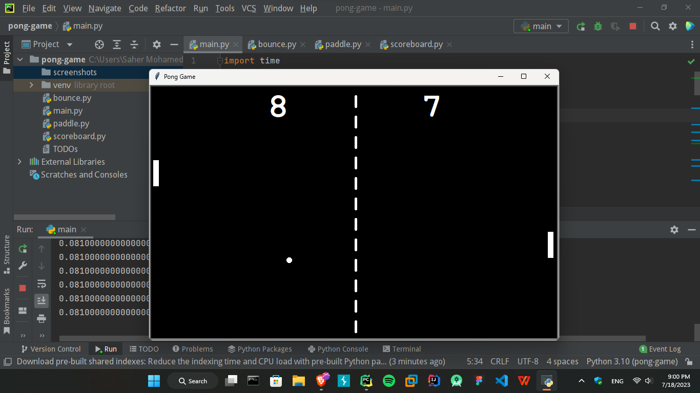

# Ping Pong Game
A simple implementation of the classic Pong game using Python and the Turtle module.

## Table of Contents
- Introduction
- Instructions
- Gameplay
- Screenshots
- Features
- Requirements
- Controls
- Credits

## Introduction
Pong is a two-player arcade game where players control paddles on either side of the screen and use them to hit a ball back and forth. The objective is to prevent the ball from going past your paddle while trying to score points by making the ball pass the opponent's paddle.  
This Python implementation of Pong provides a simple graphical interface using the Turtle module. It includes features such as paddle movement, ball bouncing, collision detection, and a scoreboard to keep track of the players' scores.

## Instructions
- Use the controls to move your paddle up and down.
- Try to hit the ball with your paddle and prevent it from crossing your side of the screen.
- Score points by making the ball pass your opponent's paddle.
- The game continues until one player reaches the maximum score limit or until you exit the game.

##Gameplay
The game starts with the ball positioned in the center of the screen. Each player controls a paddle located on the left and right sides. By moving the paddles up or down, the players can hit the ball and change its direction. The ball bounces off the walls and the paddles, simulating a real-world physics experience.  
The players score points when the ball passes their opponent's paddle. The score is displayed on the scoreboard located at the top of the screen. The game continues until a player reaches the maximum score limit or until you exit the game.

## Screenshots

## Features
- Graphical interface using the Turtle module.
- Smooth movement of paddles and ball.
- Realistic ball bouncing off walls and paddles.
- Score tracking with a scoreboard.
- Game over condition when a player reaches the maximum score.

## Requirements
Python 3.x
Turtle module (included in the standard library)

## Controls
- Left Paddle:
  - Move Up: Press the **W** key
  - Move Down: Press the **S** key
- Right Paddle:
  - Move Up: Press the **Up Arrow** key
  - Move Down: Press the **Down Arrow** key

## Credits
This game was created by **Saher Muhamed**. It is based on the classic Pong game and was implemented using Python and the Turtle module. Feel free to modify and enhance it as you wish. Have fun!
